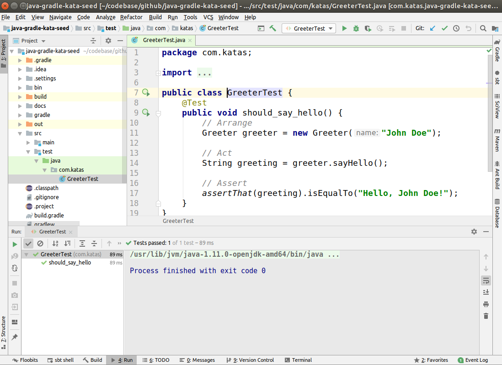
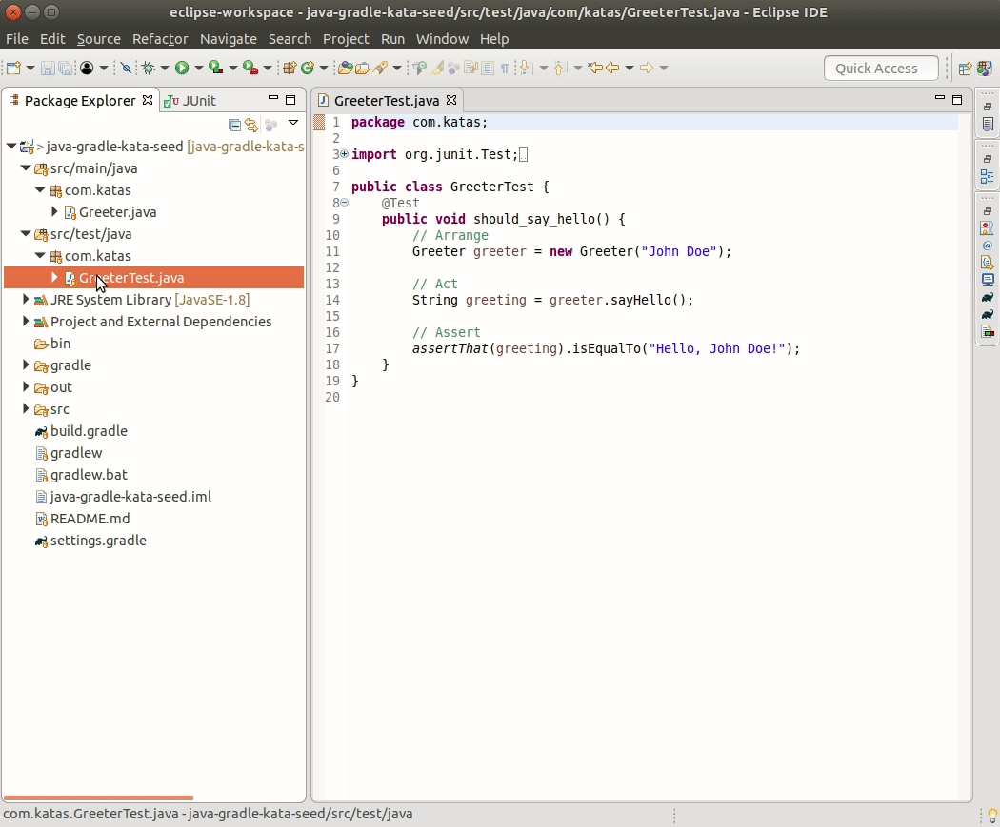

Java Kata Seed
==============

This is a seed project to quickly start practicing TDD in Java.

It includes dependencies for:
- [AssertJ](http://joel-costigliola.github.io/assertj/)
- [JUnitParams](https://github.com/Pragmatists/JUnitParams)
- [Mockito](https://site.mockito.org/)


## Dowloading the project
You can clone this project using Git
```
git clone https://github.com/paucls/java-gradle-kata-seed.git
```
or just download it directly from https://github.com/paucls/java-gradle-kata-seed/archive/master.zip and unzip it.

## Import Project

### IntelliJ IDEA
To import this project in [IntelliJ](https://www.jetbrains.com/idea/download/) follow these steps:
- Go to `File -> Open File or Project` and select the project folder `java-gradle-kata-seed`
- On the Import Project from Gradle dialog select `Use auto-import` and `Use default gradle wrapper` options. Then click OK.



### Eclipse
To import this project in [Eclipse](https://www.eclipse.org/downloads/) follow these steps:
- Go to `File -> Import -> Gradle -> Existing Gradle Project`
- Select the project folder `java-gradle-kata-seed`
- Default Import Options, this will use the Gradle wrapper.



## Run unit tests
The most convenient way of running the unit tests is directly from your IDE. They can also be run from the console using Gradle.

```
gradlew.bat test  // on Windows
./gradlew test    // on Linux
```
